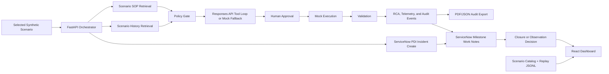

# Architecture

NEXUS-RESOLVE is split into a static replay dashboard and a local live backend.
The static mode is safe for GitHub Pages because it uses only synthetic replay
events. The local mode keeps API keys and live Responses API calls on the
developer machine.

## Data Flow

1. The run starts from the selected scenario, defaulting to `disk-space`.
   `GET /api/connectors/servicenow/mock-ticket/{scenario_id}` exposes the same
   selected scenario as a ServiceNow-style synthetic ticket contract.
2. The orchestrator retrieves the scenario-specific SOP.
3. Historical tickets are loaded from the scenario catalog and classified into safe examples,
   unsafe precedent, and escalation precedent.
4. Evidence and plan generation use an OpenAI Responses API function-calling
   loop when configured. The model can request the local SOP, history, initial
   state, and policy-preview tools before returning structured outputs.
   Otherwise a deterministic fallback plan is used.
5. Policy checks block protected resources, missing safeguards, missing approval,
   missing dry-run/mock guard, missing validation, and real execution markers.
6. The workflow pauses until human approval.
7. The mock executor changes only synthetic state and never touches the host.
8. Validation and RCA events are streamed to the dashboard and exported.
9. The operator closes the incident or starts a synthetic observation window;
   observation rechecks recovery metrics and then closes the incident.
10. AI usage telemetry is attached to generated evidence, plan, approval, and
    RCA events. The summary includes source, model, tokens when returned by the
    API, local tool-call count, latency, estimated API cost, and human-cost
    comparison at $30/hour.
11. Any active run can expose a hashed audit packet through
    `GET /api/runs/{run_id}/audit-packet`; the packet includes run status,
    events, approval record, policy checks, RCA, and safety metadata.
12. Any active run can expose a downloadable PDF report through
    `GET /api/runs/{run_id}/audit-report.pdf`; the PDF is generated from the
    same hashed packet.
13. In local live mode, the orchestrator must create one real ServiceNow PDI
    incident at run start when `APP_MODE=live`, credentials are present, and
    `SERVICENOW_CREATE_INCIDENTS=true`. If the PDI create call fails or does not
    return both the incident number and `sys_id`, the live run is not started.
14. Milestone events append work notes to the same PDI incident when
    `SERVICENOW_UPDATE_INCIDENTS=true`. The run snapshot, ticket panel, audit
    packet, and PDF include the ServiceNow incident record when attached.
15. Each real PDI incident created by the live demo is persisted to
    `data/generated/servicenow_incidents.jsonl` and exposed through
    `GET /api/connectors/servicenow/incidents` for the dashboard history panel.
16. When `SERVICENOW_RESOLVE_ON_CLOSE=true`, the `incident.closed` milestone
    also patches ServiceNow `state`, `close_code`, and `close_notes` fields
    along with the final work note.
17. The dashboard can verify a stored PDI incident number later through
    `GET /api/connectors/servicenow/incidents/{number}`, which queries the
    live ServiceNow Table API when credentials are configured.
18. Any active run can preview a ServiceNow work-note payload through
    `POST /api/runs/{run_id}/servicenow/work-note` with `dry_run=true`.
    If ServiceNow PDI credentials and update flags are configured, the same
    endpoint can write the final RCA/audit hash as an ITSM work note.

## Runtime Boundaries

- Browser replay mode: no backend, no secrets, static JSONL event playback.
- Local live mode: FastAPI, WebSocket, optional OpenAI key, optional ServiceNow
  PDI incident create and work-note credentials, mock-only execution.
- Strict ServiceNow live gate: when `APP_MODE=live`, `POST /api/incidents`
  returns a readiness error unless PDI credentials and create/update flags are
  present.
- GitHub Pages: publishes `apps/dashboard/dist` only.
- Judge deep-dive mode: static page on port 5174 that embeds the real dashboard,
  fetches live FastAPI JSON when available, and labels trace replay separately.
- Browser E2E mode: Playwright starts isolated test ports 8002, 5175, and 5176
  so the suite does not collide with the normal demo ports.
